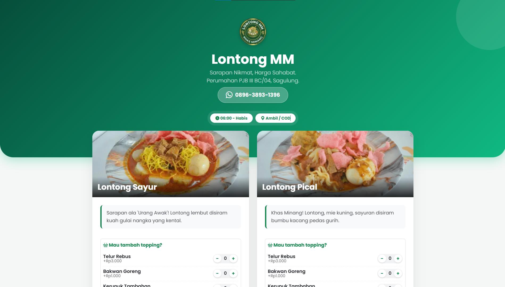
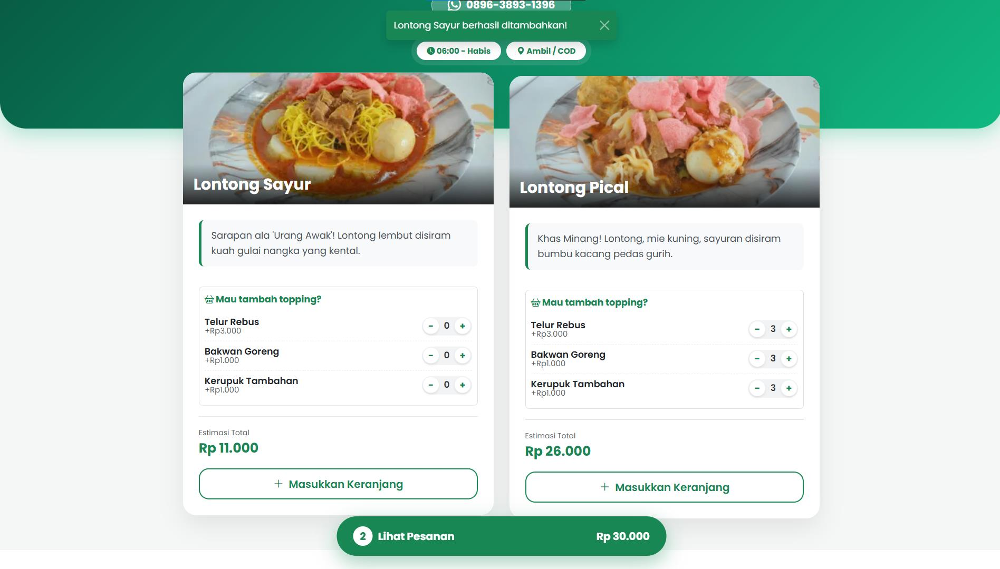
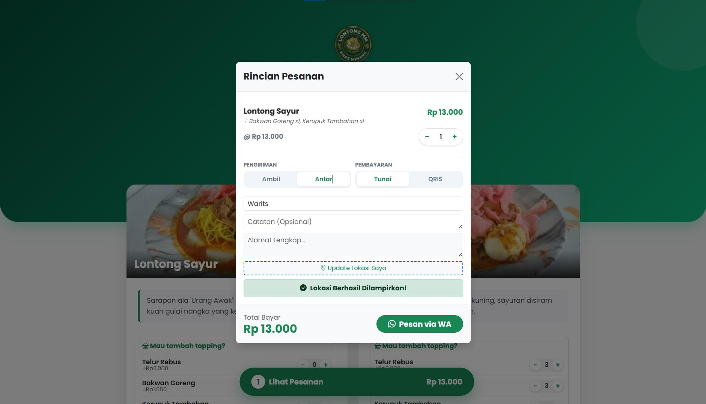
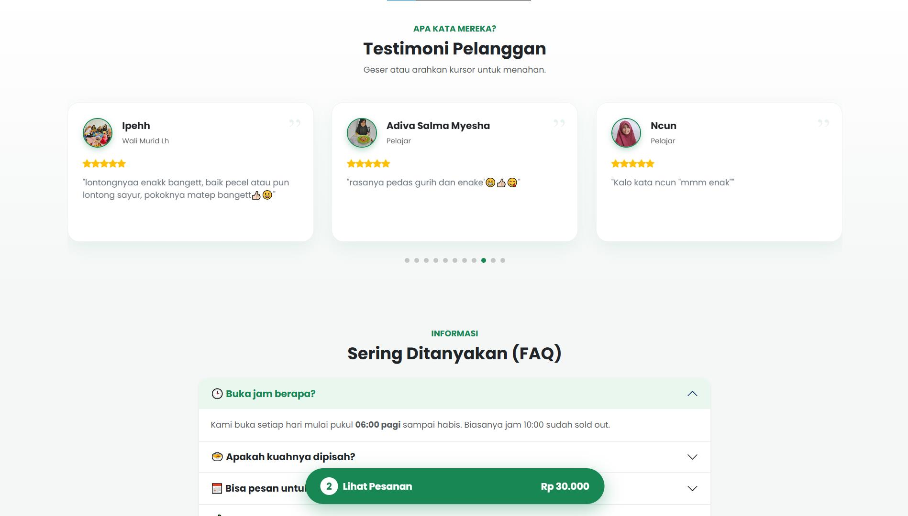
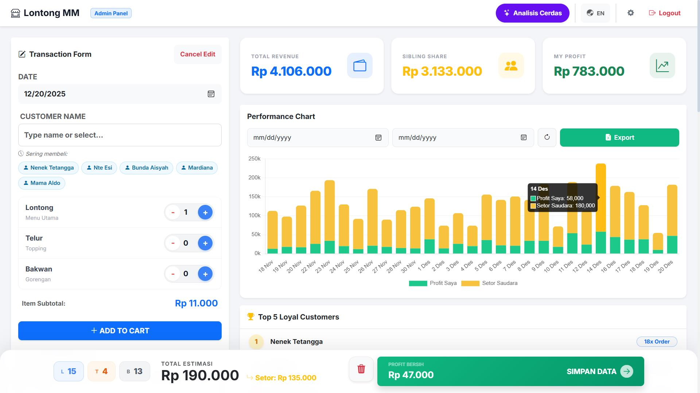
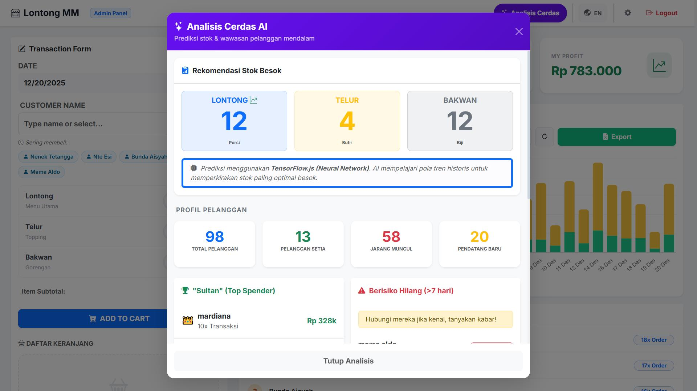
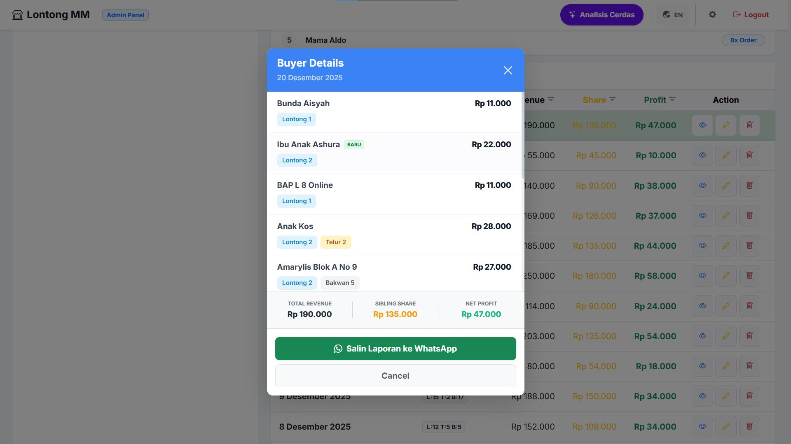

# 🥣 Lontong MM - Integrated POS & Ordering System


## 📋 Overview

**Lontong MM** is a comprehensive web-based application designed to digitalize operations for a culinary MSME (UMKM). The system bridges the gap between customers and business management through a dual-interface approach:

1.  **Customer Facing:** A responsive Progressive Web App (PWA) for browsing menus, reading testimonials, and placing orders directly via WhatsApp automation.
2.  **Admin Dashboard (POS):** A powerful control panel for the business owner to track sales, manage inventory, and analyze business performance using AI-driven insights.

This project demonstrates a full software development lifecycle (SDLC), from requirement gathering to deployment and testing.

---

## 📸 Project Showcase

### A. Customer Interface (Client-Side)
*Designed for ease of use, speed, and mobile responsiveness.*

| Landing Page & Branding | Smart Menu & Toppings |
| :---: | :---: |
|  |  |
| *Clean UI with operational hours status* | *Dynamic topping logic & live subtotal* |

| WhatsApp Checkout Integration | Social Proof (Testimonials) |
| :---: | :---: |
|  |  |
| *Auto-formatting message for WhatsApp API* | *Lazy-loaded slider with image compression* |

<br>

### B. Admin Dashboard (POS & Analytics)
*Powered by Real-time Firestore Database & Machine Learning.*

#### 1. Real-Time Analytics Dashboard
Visualizing financial health (Revenue, Profit, Share) using **Chart.js**. Data updates instantly as orders come in.


#### 2. 🧠 AI-Powered Stock Prediction (TensorFlow.js)
Implemented a **Neural Network** model directly in the browser to predict future stock needs (Lontong/Egg/Bakwan) based on historical sales trends. Also includes Customer Segmentation (RFM Analysis).


#### 3. Transaction Details & Reporting
Drill-down capability to view specific buyer details and generate instant reports.


---

## ✨ Key Features

* **Dynamic Menu:** Real-time menu & pricing updates fetched from Firestore.
* **Smart Cart System:** Local state management for cart operations with subtotal calculation.
* **WhatsApp Checkout:** Automated message formatting including order details, delivery address, and payment method (QRIS/COD).
* **Transaction Management (CRUD):** Complete capability to Create, Read, Update, and Delete sales records.
* **🤖 AI Integration:** Client-side Machine Learning using TensorFlow.js to forecast inventory demand.
* **Customer Segmentation:** Automated logic to identify "Loyal Customers," "Big Spenders (Sultans)," and "At-Risk Customers".

---

## 🛠 Tech Stack

| Category | Technologies |
| :--- | :--- |
| **Frontend** | HTML5, CSS3, JavaScript (ES6+) |
| **UI Framework** | Bootstrap 5, Bootstrap Icons |
| **Backend / DB** | Google Firebase (Firestore NoSQL) |
| **Deployment** | Firebase Hosting |
| **Data Science / AI** | **TensorFlow.js** (Client-side Machine Learning), Chart.js |
| **Tools** | Git, VS Code, SwiperJS |

---

## 🚀 Installation & Setup

To run this project locally, follow these steps:

1.  **Clone the repository**
    ```bash
    git clone [https://github.com/waritsriyadi/lontong-mm.git](https://github.com/waritsriyadi/lontong-mm.git)
    cd lontong-mm
    ```

2.  **Configure Firebase**
    * Create a project in [Firebase Console](https://console.firebase.google.com/).
    * Enable **Firestore Database**.
    * Copy your web app configuration keys.
    * Update `script.js` and `scriptadmin.js` with your config.

3.  **Run Locally**
    You can use VS Code's "Live Server" extension or Python:
    ```bash
    # Python 3
    python -m http.server 8000
    ```
    Visit `http://localhost:8000` in your browser.

---

## 🧪 Quality Assurance & Testing

As a QA-focused engineer, this project serves as a practice ground for:
* **Manual Testing:** Exploratory testing on various mobile viewports (Responsive Design).
* **Edge Case Handling:** Testing inputs for "Negative Values", "Empty Fields", and "Network Disconnects" (Firestore Persistence enabled).
* **Performance Testing:** Ensuring Lighthouse score > 90 for Performance and PWA capabilities.

---

## 👤 Author

**Warits Riyadi**
* **Role:** Fullstack Developer & QA Engineer
* **LinkedIn:** [linkedin.com/in/waritsriyadi](https://www.linkedin.com/in/waritsriyadi)
* **Email:** waritsryds@gmail.com

---

**Note:** *This project was developed for a real-world use case to support local MSME digitalization.*
